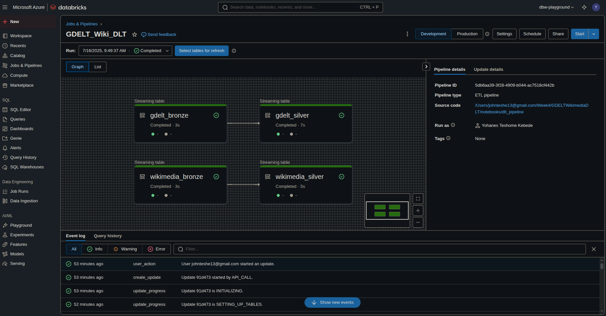
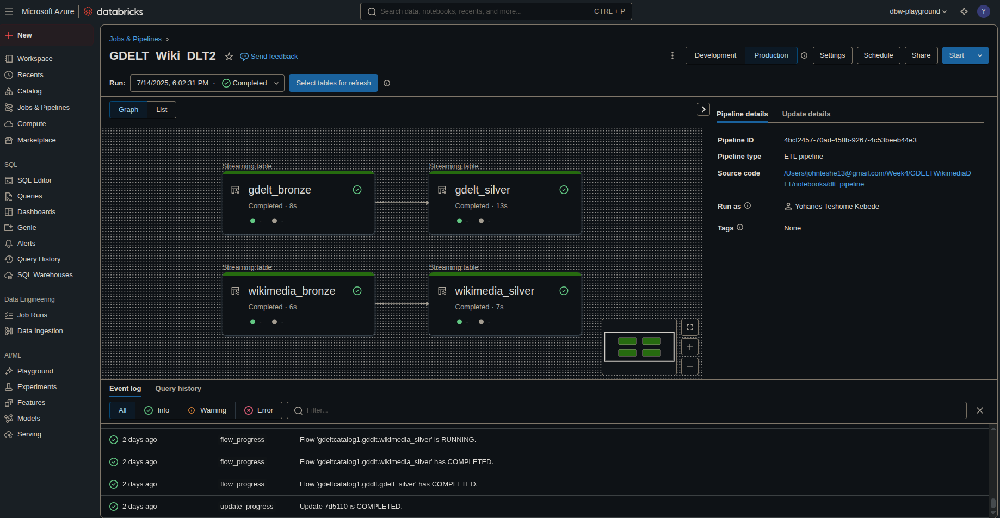
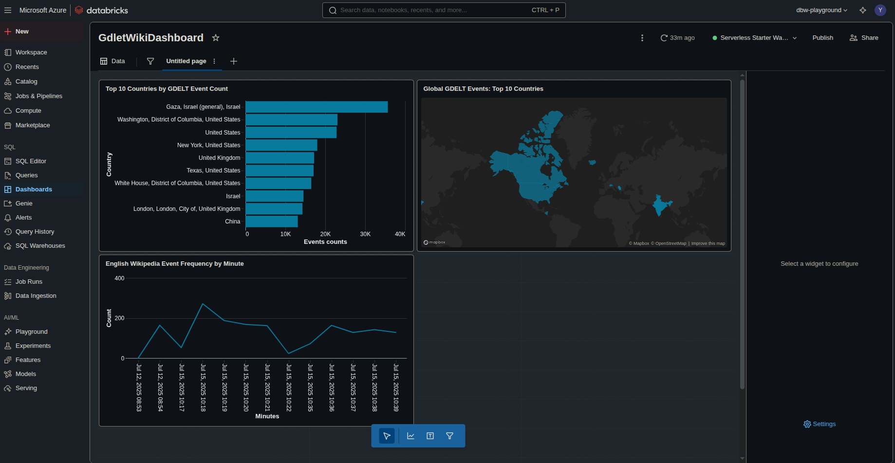
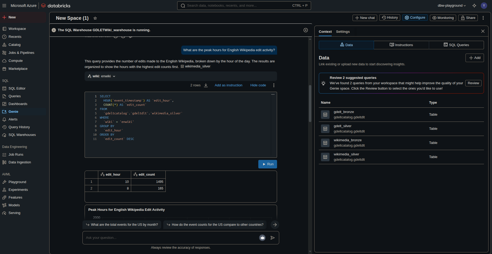
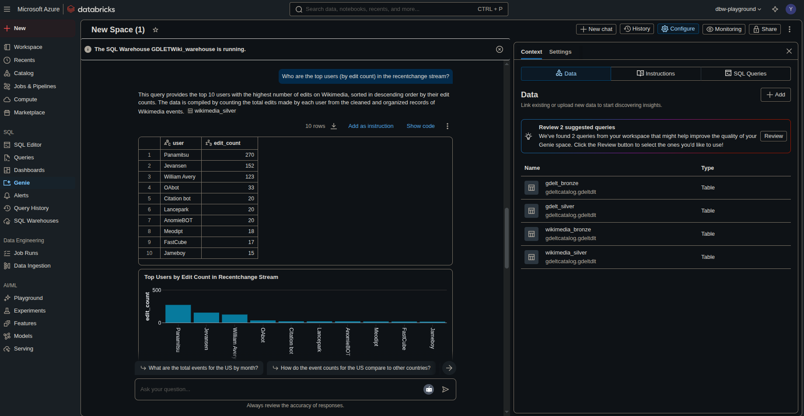
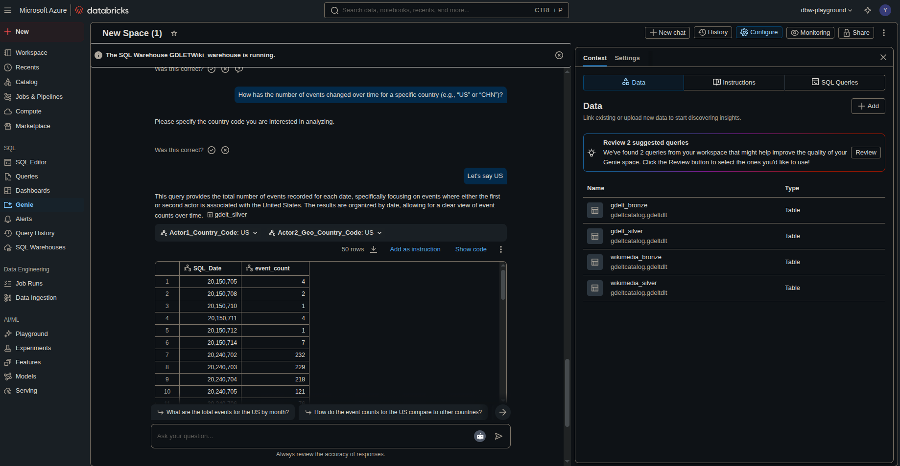
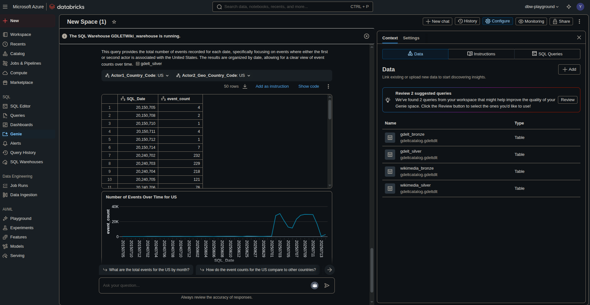

# Productionizing the Lakehouse: GDELT & Wikimedia DLT Pipeline

## Introduction

In this week’s challenge, I built a data pipeline that ingests and processes two real-world data sources—GDELT Events and Wikimedia EventStreams—using Databricks Delta Live Tables (DLT). The project covers the full workflow from raw data ingestion to CI/CD automation with GitHub Actions, highlighting both technical implementation and challenges encountered.

---

## Data Sources

1. **GDELT Events**  
   - Source: [GDELT Project](http://data.gdeltproject.org/events/)
   - Data files are available at predictable 15-minute intervals, e.g.:  
     `http://data.gdeltproject.org/events/20240624000000.export.CSV.zip`

2. **Wikimedia EventStreams**  
   - Source: [Wikimedia RecentChange Stream](https://stream.wikimedia.org/v2/stream/recentchange)
   - Provides a real-time stream of Wikipedia edit events in JSON format.

---

## Pipeline Architecture

The pipeline is organized into the following layers for each data source:

- **Staging**: Downloading and storing raw data in Azure Blob Storage.
- **Bronze**: Ingesting raw data into Delta tables with schema enforcement.
- **Silver**: Data cleaning, quality checks, and flattening.
- **Gold**: (Not implemented—see explanation below.)

---

### 1. GDELT Pipeline

#### **A. Staging Layer: Downloading GDELT Data**

A Python function downloads GDELT CSV ZIP files for a specified time range and uploads them to Azure Blob Storage. See `notebooks/01_download_gdelt.py`, function `download_and_upload_gdelt_data_range` for the full implementation.

```python
# notebooks/01_download_gdelt.py
def download_and_upload_gdelt_data_range(start_time_str, end_time_str, container_client):
    """
    Downloads and uploads GDELT data over a time range to Azure Blob Storage.
    Args:
        start_time_str (str): Start time in format 'YYYYMMDDHHMMSS'
        end_time_str (str): End time in format 'YYYYMMDDHHMMSS'
        container_client (ContainerClient): Azure Blob Storage container client
    """
    start_time = datetime.strptime(start_time_str, "%Y%m%d%H%M%S")
    end_time = datetime.strptime(end_time_str, "%Y%m%d%H%M%S")
    current_time = start_time
    interval = timedelta(minutes=15)

    while current_time <= end_time:
        timestamp = current_time.strftime("%Y%m%d%H%M%S")
        gdelt_url = f"http://data.gdeltproject.org/gdeltv2/{timestamp}.export.CSV.zip"
        try:
            print(f"\nDownloading: {gdelt_url}")
            response = requests.get(gdelt_url, timeout=10)
            if response.status_code != 200:
                print(f"Failed to download GDELT data. HTTP Status Code: {response.status_code}")
                current_time += interval
                continue
            print(f"{gdelt_url} data downloaded successfully.")
            print("Extracting ZIP file and processing CSV files...")
            with zipfile.ZipFile(io.BytesIO(response.content)) as z:
                for file_name in z.namelist():
                    print(f"Processing file: {file_name}")
                    if file_name.endswith('.CSV'):
                        csv_content = z.read(file_name)
                        print(f"Uploading file '{file_name}' to Blob Storage...")
                        blob_client = container_client.get_blob_client(file_name)
                        try:
                            blob_client.upload_blob(csv_content, overwrite=True)
                            print(f"Successfully uploaded '{file_name}' to Blob Storage.")
                        except Exception as upload_err:
                            print(f"Failed to upload '{file_name}' to Blob Storage: {upload_err}")
        except Exception as e:
            print(f"Error occurred for {gdelt_url}: {e}")
        current_time += interval
```

- **Key Points:**
  - Downloads 15-minute interval files between `start_time_str` and `end_time_str`.
  - Extracts CSVs from ZIPs and uploads them to Azure Blob Storage.
  - Handles download/upload errors gracefully.

#### **B. Bronze Layer: Raw Ingestion with Schema Enforcement**

Defined a detailed schema for the 61-column GDELT dataset using PySpark’s `StructType`.  
Data is loaded into a Delta Live Table using Databricks Auto Loader. See `notebooks/dlt_pipeline.py`, function `gdelt_bronze`.

```python
# notebooks/dlt_pipeline.py
gdelt_schema = StructType([
    StructField("Global_Event_ID", LongType()),
    StructField("SQL_Date", IntegerType()),
    StructField("Month_Year", IntegerType()),
    StructField("Year", IntegerType()),
    StructField("Fraction_Date", DoubleType()),
    # ... (rest of the 61 columns as in the code)
])

@dlt.table(
    name="gdelt_bronze",
    comment="Raw GDELT events loaded via Auto Loader (full schema)"
)
def gdelt_bronze():
    return (
        spark.readStream
             .format("cloudFiles")
             .option("cloudFiles.format", "csv")
             .option("delimiter", "\t")
             .option("cloudFiles.schemaLocation", "/mnt/gdelt-raw/_schema")
             .schema(gdelt_schema)
             .load(GDELT_PATH)
    )
```

#### **C. Silver Layer: Data Cleaning & Quality Checks**

- **Data Quality Rules:**  
  Enforced a comprehensive set of DQ rules (e.g., valid event IDs, date ranges, latitude/longitude bounds). See `src/dq_rules/gdelt.py` for the full set of rules.

- **Transformations:**
  - Dropped columns with only null values.
  - Replaced nulls in string columns with `"Unknown"`.
  - Added a human-readable event timestamp.

```python
# notebooks/dlt_pipeline.py
GDLET_DQ_RULES = {
    "valid_global_event_id": "Global_Event_ID IS NOT NULL",
    "valid_event_code": "Event_Code IS NOT NULL",
    "valid_sql_date": "SQL_Date >= 19000101 AND SQL_Date <= 99991231",
    # ... (other rules in src/dq_rules/gdelt.py)
}

@dlt.table(
    name="gdelt_silver",
    comment="Records passing all quality checks"
)
@dlt.expect_all_or_drop(expectations=GDLET_DQ_RULES)
def gdelt_silver_clean():
    df = dlt.read_stream("gdelt_bronze")
    df = df.drop("Actor1_Type2_Code", "Actor2_Type2_Code")
    string_columns = [
        # ... (list of string columns)
    ]
    for col_name in string_columns:
        df = df.withColumn(col_name, coalesce(col(col_name), lit("Unknown")))
    df = df.withColumn("event_timestamp", from_unixtime(col("SQL_Date").cast("string"), "yyyyMMdd"))
    return df
```

---

### 2. Wikimedia Pipeline

#### **A. Staging Layer: Downloading Wikimedia Event Batches**

Due to UDTF limitations in DLT, I implemented a batch downloader for the Wikimedia SSE stream, buffering events and uploading them as JSON blobs. See `notebooks/02_download_wikimedia.py`, function `stream_and_upload_wikimedia`.

```python
# notebooks/02_download_wikimedia.py
def stream_and_upload_wikimedia(
    container_client: ContainerClient,
    batch_size: int = 100,
    max_batches: int = None,
    sleep_interval: float = 0.1
):
    """
    Connects to the Wikimedia recent-change SSE feed, buffers `batch_size`
    JSON lines, and uploads each batch as a blob.
    """
    url = "https://stream.wikimedia.org/v2/stream/recentchange"
    batch = []
    batches_uploaded = 0
    try:
        with requests.get(url, stream=True) as resp:
            resp.raise_for_status()
            for line in resp.iter_lines():
                if not line:
                    time.sleep(sleep_interval)
                    continue
                text = line.decode("utf-8", errors="ignore")
                if text.startswith("data:"):
                    json_str = text[len("data:"):].lstrip()
                    batch.append(json_str)
                if len(batch) >= batch_size:
                    timestamp = int(time.time())
                    blob_name = f"batch_{timestamp}.json"
                    blob_data = "\n".join(batch).encode("utf-8")
                    print(f"Uploading {blob_name} with {len(batch)} events...")
                    container_client.upload_blob(name=blob_name, data=blob_data, overwrite=True)
                    print("Upload complete.")
                    batch.clear()
                    batches_uploaded += 1
                    if max_batches and batches_uploaded >= max_batches:
                        print("Reached max_batches limit; stopping.")
                        break
    except Exception as e:
        print(f"An error occurred: {e}")
        raise
```

#### **B. Bronze Layer: Raw JSON Ingestion with Schema**

Defined a nested schema for the complex Wikimedia event structure and ingested the data using Auto Loader. See `notebooks/dlt_pipeline.py`, function `wikimedia_bronze`.

```python
# notebooks/dlt_pipeline.py
wiki_schema = StructType([
    StructField("$schema", StringType(), True),
    StructField("bot", BooleanType(), True),
    StructField("comment", StringType(), True),
    StructField("id", LongType(), True),
    # ... (rest of the schema fields)
])

@dlt.table(
    name="wikimedia_bronze",
    comment="Raw JSON payloads from Wikimedia recent-change stream"
)
def wikimedia_bronze():
    return (
        spark.readStream
        .format("cloudFiles")
        .option("cloudFiles.format", "json")
        .option("cloudFiles.schemaLocation", "/mnt/wikimedia-raw/_schema")
        .schema(wiki_schema)
        .load(WIKIMEDIA_PATH)
    )
```

#### **C. Silver Layer: Cleaning, Filtering, and Flattening**

- **Data Quality Rules:**  
  Checked for non-null IDs, positive timestamps, and non-empty titles. See `src/dq_rules/wikimedia.py` for the full set of rules.

- **Transformations:**
  - Dropped rescued data and non-English events.
  - Flattened nested fields.
  - Replaced nulls in string columns with `"Unknown"`.
  - Added a readable event timestamp.

```python
# notebooks/dlt_pipeline.py
WIKI_DQ_RULES = {
    "valid_id": "id IS NOT NULL",
    "valid_timestamp": "timestamp > 0",
    "non_empty_title": "length(title) > 0",
}

@dlt.table(
    name="wikimedia_silver",
    comment="Cleaned and flattened Wikimedia events"
)
@dlt.expect_all_or_drop(expectations=WIKI_DQ_RULES)
def wikimedia_silver():
    bronze = dlt.read_stream("wikimedia_bronze")
    bronze = bronze.drop("_rescued_data")
    bronze = bronze.filter(col("wiki") == "enwiki")
    df = (bronze
          .withColumn("length_new", col("length.new"))
          .withColumn("length_old", col("length.old"))
          .withColumn("revision_new", col("revision.new"))
          .withColumn("revision_old", col("revision.old"))
          .withColumn("meta_domain", col("meta.domain"))
          .withColumn("meta_dt", col("meta.dt"))
          .withColumn("meta_offset", col("meta.offset"))
          .withColumn("meta_partition", col("meta.partition"))
          .withColumn("meta_request", col("meta.request_id"))
          .withColumn("meta_stream", col("meta.stream"))
          .withColumn("meta_topic", col("meta.topic"))
          .withColumn("meta_uri", col("meta.uri"))
     )
    df = df.drop("length", "revision", "meta")
    string_columns = [
        # ... (list of string columns)
    ]
    for c in string_columns:
        df = df.withColumn(c, coalesce(col(c), lit("Unknown")))
    df = df.withColumn("event_timestamp", from_unixtime(col("timestamp")))
    return df
```

---

### 3. Gold Layer

**Not Implemented:**  
There is no direct relationship between the GDELT and Wikimedia datasets, so a Gold layer (typically used for business-level aggregations or joins) was not created.

---

## Pipeline Execution

After implementing the layers, I executed the pipeline in Databricks.  
*Example Databricks UI screenshot:*  


---

## CI/CD Automation with GitHub Actions

### **Why Asset Bundles?**

Initially, I tried using the `--json-file` flag for pipeline deployment, but it is deprecated. I switched to using Databricks Asset Bundles, which offer:

- Human-friendly YAML configuration (`databricks.yml`)
- Support for multiple assets and environments (dev/prod)
- Easier lifecycle management (validate → deploy → run)

**Sample `databricks.yml`:**

```yaml
bundle:
  name: gdelt_dlt_pipeline

resources:
  pipelines:
    gdelt_wiki_dlt:
      name: GDELT_Wiki_DLT2
      catalog: gdeltcatalog1 
      schema:  gddlt  
      development: false
      continuous: false
      libraries:
        - notebook:
            path: /Users/johnteshe13@gmail.com/Week4/GDELTWikimediaDLT/notebooks/dlt_pipeline
      clusters:
        - label: default
          node_type_id: Standard_D4s_v3
          autoscale:
            min_workers: 1
            max_workers: 3

targets:
  prod:
    mode: production
    workspace:
      host: https://adb-4336080139557394.14.azuredatabricks.net
```

### **GitHub Actions Workflow**

On every push to `main`, the workflow:

1. Installs the Databricks CLI
2. Validates the bundle
3. Deploys the pipeline to the Databricks workspace
4. Runs the pipeline

**Sample GitHub Actions YAML:**

```yaml
name: Deploy DLT Pipeline

on:
  push:
    branches: [ main ]

jobs:
  deploy:
    runs-on: ubuntu-latest

    steps:
    - name: Checkout code
      uses: actions/checkout@v4
    
    - name: Install Databricks CLI
      run: |
        curl -fsSL https://raw.githubusercontent.com/databricks/setup-cli/v0.259.0/install.sh | sh
        echo "/usr/local/bin" >> $GITHUB_PATH

    - name: Check Databricks CLI version
      run: databricks --version

    - name: Deploy pipeline
      env:
        DATABRICKS_HOST: ${{ secrets.DATABRICKS_HOST }}
        DATABRICKS_TOKEN: ${{ secrets.DATABRICKS_TEST }}
      run: |
        databricks bundle validate 
        databricks bundle deploy -t prod
        databricks bundle run -t prod gdelt_wiki_dlt
```

- **Secrets Required:**  
  - `DATABRICKS_HOST`
  - `DATABRICKS_TOKEN`

*Example GitHub Actions UI screenshot:*  


---

## Challenges & Lessons Learned

- **Schema Complexity:**  
  Defining and enforcing schemas for both GDELT and Wikimedia required careful mapping of all fields, especially for nested JSON structures.

- **DLT Limitations:**  
  Direct streaming from Wikimedia EventStreams to DLT was not feasible due to UDTF limitations, necessitating a batch-based workaround.

- **CI/CD Evolution:**  
  The deprecation of the `--json-file` flag led to the adoption of asset bundles, which ultimately streamlined deployment and configuration.

---

## Visualizations

To gain insights from the processed data, I created several SQL queries (located in the `sql/` folder) and used their results to build a dashboard.

### SQL Queries Overview

- **top_countries_gdelt.sql**
  - Identifies the top countries by event count from the GDELT dataset, helping to visualize which countries are most frequently involved in global events.

- **global_gdelt_top_10_countries.sql**
  - Retrieves the top 10 countries globally with the highest number of GDELT events, providing a focused view on the most active regions.

- **silver_gdelt_secure_view.sql**
  - Creates a secure view on the silver GDELT table, ensuring sensitive or unnecessary columns are excluded for downstream analytics and dashboarding.

- **en_wiki_events_by_minute.sql**
  - Aggregates English Wikipedia edit events by minute, allowing for time-based analysis and visualization of editing activity trends.

### Dashboard

Using the results of these queries, I built a dashboard to visualize key metrics and trends from both the GDELT and Wikimedia datasets. The dashboard includes:

- Top countries by event count (GDELT)
- Global top 10 countries (GDELT)
- Wikipedia edit activity over time (English only)



## Genie: AI-Powered Data Exploration

To further explore and analyze my GDELT and Wikimedia datasets, I leveraged Genie, the Databricks AI assistant. Genie allows users to ask natural language questions about their data and receive instant SQL queries, visualizations, or summaries in response.

### Example Questions I Asked Genie

- Which countries have the highest number of GDELT events in the last month?
- What are the most common event types in the GDELT dataset?
- What are the peak hours for English Wikipedia edit activity?
- Who are the top users editing English Wikipedia recently?
- Is there a correlation between spikes in GDELT events and Wikipedia edit activity?


### Genie in Action

Below are screenshots of my interactions with Genie, demonstrating how it generated insights and visualizations from my data:

- 
- 
- 
- 

Using Genie made it much easier and faster to explore my lakehouse data, validate hypotheses, and create visualizations for my report and dashboard.


## Databricks Application Prototype

For the bonus task, I attempted to design and implement a simple Databricks App (using Streamlit) that would allow users to select a date range and country, and then view timelines of major GDELT events and Wikipedia edit activity for that country.


However, when I tried to run the app, I ran into an error saying that `JAVA_HOME` was not set. Because of this environment issue, I was unable to complete the implementation of the app.

